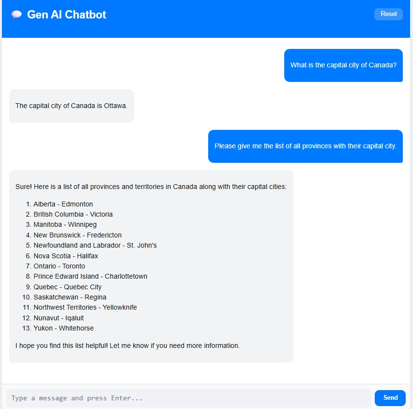

# 💬 GenAI Chatbot Frontend (Vite + React)

This is the **frontend** of the GenAI Chatbot project built with **React (Vite)**.  
It provides a clean, ChatGPT-style user interface that communicates with a **Flask + OpenAI** backend.

## 🚀 Features

- ⚡ Fast development with **Vite**
- 💬 ChatGPT-like conversation interface
- 🤖 Real-time responses from OpenAI via Flask backend
- 💾 Persistent chat history (localStorage)
- ✨ Animated message rendering (Framer Motion)
- 🧾 Markdown formatting for AI responses

## ⚙️ Installation & Setup


### 1. Clone the Repository & Navigate to Frontend Folder

```bash
git clone https://github.com/<your-username>/genaiChatbot.git
cd genaiChatbot/frontend
```

### 2. Install Dependencies

```
npm install
```


### 3. Set Backend API URL

Create a .env file in the frontend folder:

```
VITE_API_URL=http://127.0.0.1:5000
```

### 4. Start the Development Server

Run the development server using Vite:

```
npm run dev
```

Output will look like:

```
  VITE v5.x.x  ready in 600 ms

  ➜  Local:   http://localhost:5173/
  ➜  Network: use --host to expose

```

Open your browser and visit:
  👉 http://localhost:5173
  

or 

```
npm start
```

This will start the app at:

```
http://localhost:3000
```

Make sure your backend (Flask) is running on *http://127.0.0.1:5000.*


## 🧩 Project Structure

```
frontend/
│
├── src/
│   ├── components/
│   │   └── ChatWindow.jsx        # Main chat component
│   ├── styles/
│   │   └── ChatWindow.css        # Chat UI styling
│   ├── App.jsx                   # Root React component
│   ├── main.jsx                  # Entry point
│   └── index.html                # Base HTML file
│
├── .env                          # API URL configuration
├── package.json
└── package-lock.json
```


## 💻 Example Chat UI

  * User message: right-aligned (blue bubble)
  * AI message: left-aligned (gray bubble)
  * Typing dots animation
  * Smooth scroll to latest message
  * Clear chat button

## 🛠️ Tech Stack

  * React 18+
  * Vite 5+
  * Framer Motion (animations)
  * React Markdown (formatted AI responses)
  * CSS3 / Flexbox (responsive layout)

## ⚡ Build for Production

When ready to deploy:

```
npm run build
```

This creates an optimized dist/ folder.

You can serve it using:
```
npm run preview
```

Or integrate the built files into your Flask app’s static directory.


## 🧠 The App's Workflow

  1. User types a question.
  2. Frontend sends POST → /api/chat to Flask.
  3. Flask calls OpenAI API and returns the response.
  4. Frontend renders the reply with typing animation.
  5. Chat history persists locally.


## 🧾 License

This project is open-source under the MIT License.

## ✨ Author

### Sanjoy Kumar Das
### 💻 Full-Stack Developer (Python | React | AI)
### 🌐 GitHub


