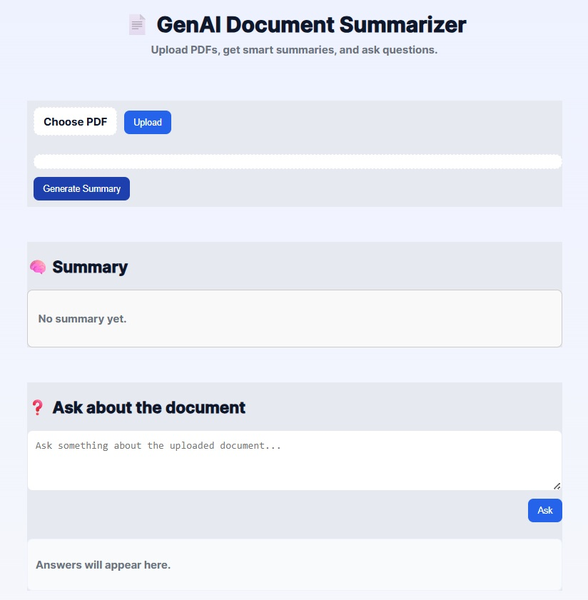
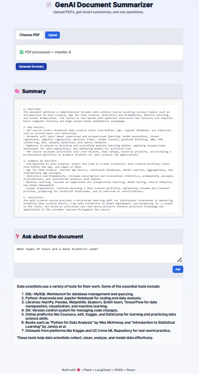

# GenAI Document Summarizer

A web application that allows users to upload PDFs, generate AI-powered summaries, and ask questions about the content using OpenAI, LangChain, and FAISS. Built with a **Flask backend** and **React frontend**.

---

## Table of Contents

- [Features](#features)
- [Tech Stack](#tech-stack)
- [Project Structure](#project-structure)
- [Setup & Installation](#setup--installation)
  - [Backend](#backend)
  - [Frontend](#frontend)
- [Usage](#usage)
- [Environment Variables](#environment-variables)
- [API Endpoints](#api-endpoints)
- [Contributing](#contributing)
- [License](#license)

---

## Features

- Upload PDF documents.
- Extract text from PDFs and split into chunks.
- Generate embeddings and store in FAISS vector database.
- Summarize the entire document using OpenAI LLM.
- Ask questions and get AI-powered responses using context retrieval.
- Responsive web UI with React for desktop, tablet, and mobile.

---

## Tech Stack

**Backend:**

- Python 3.10+
- Flask
- LangChain & LangChain-Community
- FAISS for vector database
- PyPDF2 for PDF parsing
- OpenAI API

**Frontend:**

- React 18
- Vite
- CSS (custom styles)
- Components for file upload, summary, and QA widget

---

## Project Structure


---

## Setup & Installation

### Backend

1. Navigate to backend folder:

```bash
cd backend
```

2. Create a virtual environment (if not already):

```
python -m venv .venv
```

3. Activate the virtual environment:

  * Windows:
    ```
    .venv\Scripts\activate
    ```

  * Mac/Linux:
    ```
    source .venv/bin/activate
    ```

4. Install dependencies:

```
pip install -r requirements.txt
```

5. Create a .env file and add your OpenAI API key:

```
OPENAI_API_KEY=your_openai_api_key
FLASK_ENV=development # only for development
PORT=5000
```

6. Run the Flask app:
```
python app.py
```

Backend will run on http://127.0.0.1:5000

###  Frontend

1. Navigate to frontend folder:

```
cd frontend
```

2. Install dependencies:

```
npm install
```
3. Create a .env file and specify API URL (if different from default):

```
VITE_API_URL=http://127.0.0.1:5000
```

4. Start the development server:
```
npm run dev
```

Frontend will run on http://localhost:5173.

## Usage

  - Open the frontend in a browser: http://localhost:5173.
  - Upload a PDF using the FileUploader component.
  - Click Generate Summary to get an AI-powered summary.
  - Ask questions in the QA Widget to get context-aware answers.
  - All uploaded PDFs and FAISS indexes are stored in backend/uploads.

## Environment Variables

### Backend (.env):

```
OPENAI_API_KEY=your_openai_api_key
PORT=5000
```

### Frontend (.env):

```
VITE_API_URL=http://127.0.0.1:5000
```

## API Endpoints

### Upload PDF

```
POST /api/upload
Form Data: file (PDF)
Response: { "message": "...", "chunks": n }
```

### Summarize Document

```
GET /api/summarize
Response: { "summary": "..." }
```

### Ask Question

```
POST /api/query
JSON: { "question": "..." }
Response: { "answer": "..." }
```

## Contributing

Contributions are welcome! Please fork the repository and submit a pull request with improvements.

## License

This project is licensed under the MIT License.

### Built with ❤️ using Flask, LangChain, FAISS, and React

### Intial Screen:


### Result after uploading pdf file and asking question:



I can also create a **ready-to-use `requirements.txt` for backend** and a **`package.json` snippet for frontend** so that anyone can clone and run it immediately.  

Do you want me to generate those too?

